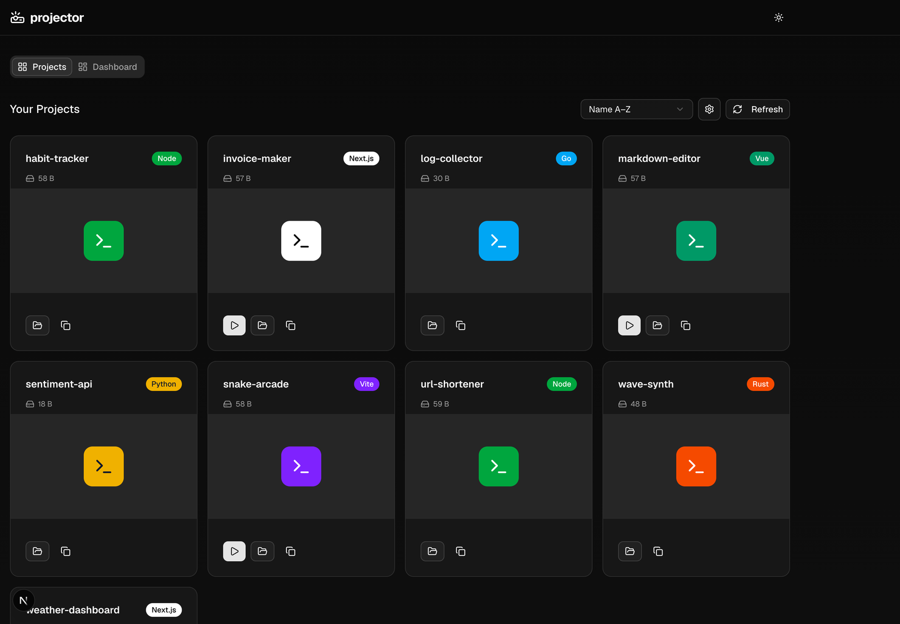

<p align="center">
  
</p>

# projector

A centralized launchpad for your projects. Scan a folder, detect project types, run multiple dev servers at once, and view thumbnails.

## Features

- **Folder-based discovery** – Configure a folder where your projects live (e.g. `~/repos`)
- **Project type detection** – Automatically detects Next.js, React, Vite, Vue, Node, Python, Rust, and Go
- **Multi-server runner** – Start and stop dev servers for many projects at once
- **Thumbnails** – Add `thumbnail.png`, `screenshot.png`, or `preview.png` in a project root for a custom thumbnail
- **projector excluded** – When your projects folder contains project-hub, it’s excluded from the list

## Getting Started

```bash
npm install
npm run dev
```

Open [http://localhost:4000](http://localhost:4000), click the settings icon, and set your projects folder path (e.g. `/Users/you/repos` or the parent of where project-hub lives).

## Usage

1. **Configure** – Open Settings and set your projects folder path.
2. **Scan** – projector scans for subdirectories and detects types.
3. **Run** – Click the play button on a project to start its dev server.
4. **Open** – When a server is running, use the external link to open it in a new tab.
5. **Copy path** – Use the copy icon to copy the project path to the clipboard.

## Tech Stack

- Next.js 16
- shadcn/ui
- Tailwind CSS

## Screenshot


